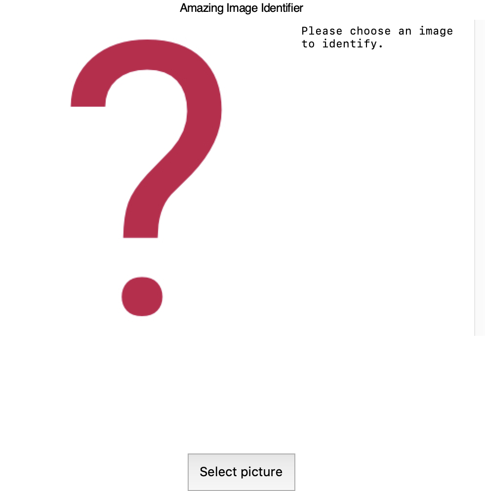

## Introduction

Create a product — a tool, app, or website — that uses machine vision to do something cool.

### What you will make
You will use a pre-trained image classification model to build your product. You’ll combine this model with code for either:
 + A web application, built with Flask
 + A command line tool
 + A desktop application, built with guizero

### What you will learn
 + How to connect a machine vision model into a larger Python program
 + How to load a model made by someone else into your program

### What you should know
To complete this project, you should know how to:
 + Interact with a machine vision model, as covered in [Testing your computer’s vision](https://projects.raspberrypi.org/en/projects/testing-your-computers-vision)
 + Create and use variables, lists, conditional statements, and functions in Python

--- collapse ---
---
title: Other skills that might be useful
---

You do not need to have any other skills to complete this project. However, you might like to consider the suggestions below if you want to create more complex, or visually impressive, results:
#### For web projects
If you’re going to build the web application, knowing how to code with HTML, CSS, and JavaScript will let you build a sophisticated interface around the machine vision model. 
 + The [Guide to my country](https://projects.raspberrypi.org/en/projects/cd-beginner-html-css-sushi) project shows you how to create a website with HTML and CSS
 + [Guess the colour!](https://projects.raspberrypi.org/en/projects/cd-beginner-javascript-sushi) and [To-do list](https://projects.raspberrypi.org/en/projects/cd-intermediate-javascript-sushi) both show you how to use JavaScript to create more complex, interactive websites
 + [Build a Python web server with Flask](https://projects.raspberrypi.org/en/projects/python-web-server-with-flask) shows you how to take full advantage of Flask’s templates to include the information from your machine vision model in a web page

#### For desktop projects
If you want to build a desktop application, you can check out [Getting started with GUIs](https://projects.raspberrypi.org/en/projects/getting-started-with-guis) to see the full variety of features and controls you can add to it.

--- /collapse ---

--- collapse ---
---
title: What you will need
---
### Hardware

+ A computer with an internet connection

### Software

+ Python 3
+ The pip Python package installer (usually included with Python 3), and permission to install Python packages on your computer

--- /collapse ---

--- collapse ---
---
title: Additional information for educators
---

If you need to print this project, please use the [printer-friendly version](https://projects.raspberrypi.org/en/projects/amazing-image-identifier/print){:target="_blank"}.

--- /collapse ---
