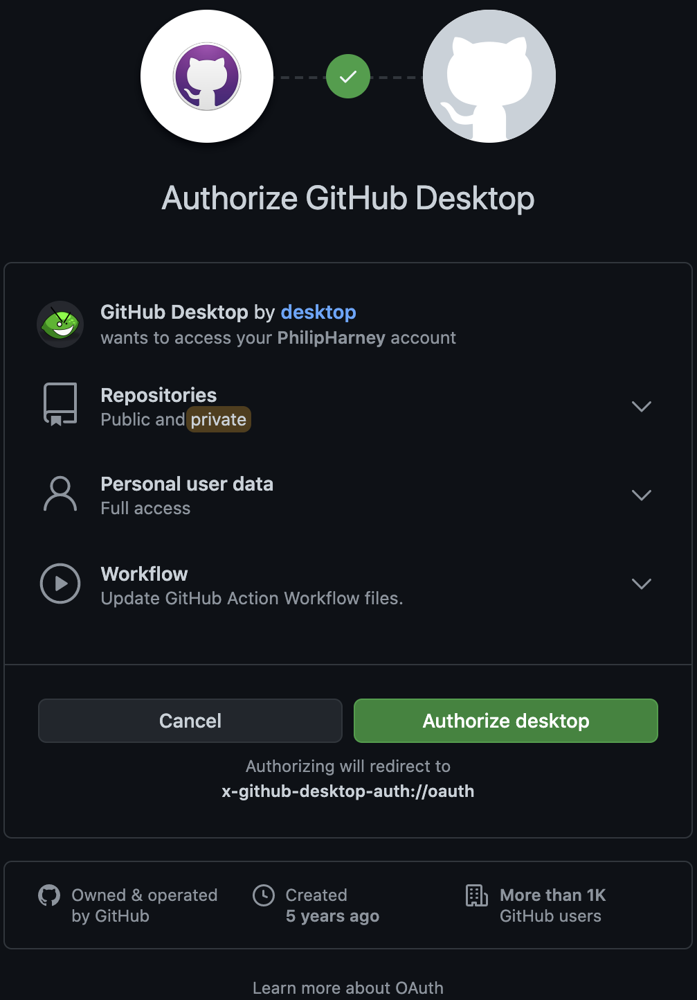

## Share

### Sharing your code on GitHub
GitHub is a website where you can use a tool called Git to store and share coding projects, which Git calls **repositories**, or **repos** for short. Git, and GitHub, are used by millions of professional computer programmers every day. Every project on this website is stored on GitHub.

#### Be careful what you share

GitHub is on the web, so you should be just as careful about the kind of information you share there as you would on any other website or app: Don't include photos of yourself, or your friends; Don't include passwords or usernames; If you're ever unsure about sharing anything online, check with an adult you trust first.

#### Setting up GitHub

--- collapse ---
---
title: Getting a GitHub account
---
If you're over the age of thirteen, you can register for your own GitHub account. If you're not, you'll need a parent or guardian to set up an account and allow you to use it.

Create an account by filling in the relevant details on the [GitHub site](https://github.com/join).
--- /collapse ---

--- collapse ---
---
title: Installing GitHub Desktop on Windows
---

Go to [the GitHub Desktop webpage](https://desktop.github.com/) and click the "Download for Windows" button. This will download a `.exe` file to your computer. Run this fill to install GitHub Desktop.
--- /collapse ---

--- collapse ---
---
title: Installing GitHub Desktop on Mac OS
---

Go to [the GitHub Desktop webpage](https://desktop.github.com/) and click the "Download for macOS" button. This will download a `.zip` file to your computer. Click on this to extract it, and then drag the GitHub Desktop application into the Applications folder on your computer.

Then double-click on GitHub Desktop to start the application. The first screen will instruct you to 'Sign in to GitHub.com'. Click that button.


Your web browser will open, and you may have to sign in to your GitHub account. You will then be presented with a screen asking you to 'Authorize GitHub Desktop'. Do so by clicking the 'Authorize desktop' button and then entering your password, if prompted.



You may have give permission for your browser to redirect you back to the GitHub Desktop application. Will then reach the Git configuration screen in the GitHub Desktop application. 'Use my GitHub account name and email address' should already be selected. Just click on the 'Continue' button.

You will then be asked if you want to share usage information with GitHub. Un-check the 'Yes, submit periodic usage stats' box, and click 'Finish'.

You will then reach a "Let's get started!" screen. On this screen, choose the "Create a New Repository on your Hard Drive" option and fill in the details:

 + **Name** can be anything you want, but remember everyone on the web can see it, so don't use your name or other personal information!
 + **Description** is optional, and just a space for you to describe what the code in the repository is for.
 + **Local Path** is where you want to store the code for this repository on your computer.
 + The **Initialize this repository with a README** option is useful if you're creating a completely new project, and you want to be able to put it on GitHub before you've written any code. The repository has to contain something, so a README file is what's used. You don't need it for this project, so leave it un-checked.
 + The **Git Ignore** option lets you select premade lists of files Git should not store as part of the repository, even if they're in the repository folder. For example, some programs create temporary files to store information, or have files with sensitive data — like names or passwords — that shouldn't be stored or published to GitHub. This is a Python project, so choose 'Python' from the list.
 + The **License** option lets you select the kind of permissions you want to give other people to use and change your code. For now, you don't really need to worry about that. Leave this option at 'None' for now.

Once you've made all your choices, click the 'Create Repository' button. You now have your first Git repo!

Click the 'Show in Finder' button to open a Finder window for your repo.


--- /collapse ---

--- collapse ---
---
title: Installing Git on Linux
---

GitHub Desktop doesn't exist for Linux, so you get to use the command line version of Git, which a lot of programmers do prefer.

Open your terminal and run this command to make sure you have the latest version of your package installer — the program Liunx uses to install new programs — available:

```bash
sudo apt-get update
```

Now you're ready to install Git, which you can do by running this command:

```bash
sudo apt-get install git-all
```

--- /collapse ---

#### Making changes to your repository
To change your repository, all you need to do is change what's in the repository folder and then use GitHub Desktop, or Git on the command line, to **commit** those changes to the repository.

--- collapse ---
---
title: Committing changes with GitHub Desktop
---


--- /collapse ---

--- collapse ---
---
title: Committing changes with Git in a CLI
---


--- /collapse ---

### Sharing your web app in a coding club

You can share your Flask web app with other computers on the same Wi-Fi or network. To do this, you will need to find your IP address, which you can do from the command line.

--- collapse ---
---
title: What is an IP address?
---
An IP address is a set of numbers that uniquely identify your computer on a network, and can be used to have one computer talk to another. An IP address is four sets of numbers, broken up by dots, like this: `192.168.86.229`.

The whole internet works based on computers using IP addresses to talk to each other — IP actually stands for Internet Protocol. Domain names like raspberrypi.org are just used to look up the right IP address, although they are a lot easier for people to remember!

The IP address you're using here is called your **private IP address**, because it only works inside your local network. The entire network usually shares a single IP address for connecting to other computers over the internet.
--- /collapse ---

--- collapse ---
---
title: Finding your IP address on Windows
---
In your command prompt, run this command:

```batch
ipconfig
```

You will get a lot of information back, but just find the line that begins with `IPv4 Address` — the number on that line is what you need.
--- /collapse ---

--- collapse ---
---
title: Finding your IP address on Mac OS
---
In your terminal, run this command:

```bash
ipconfig getifaddr en1
```

The response is your IP address.
--- /collapse ---

--- collapse ---
---
title: Finding your IP address on Linux (including Raspberry Pi)
---
In your terminal, run this command:

```bash
hostname -I
```

The response is your IP address.
--- /collapse ---

--- collapse ---
---
title:  Sharing your app
---
Once you have your IP address, all other people on your network need to do is open their web browser and type your IP address followed by `:5000` into the address bar. For example `192.168.86.229:5000` would work for a computer with that IP address.

--- /collapse ---


