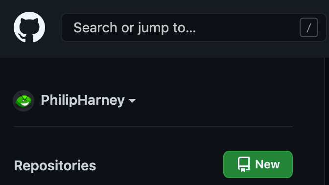
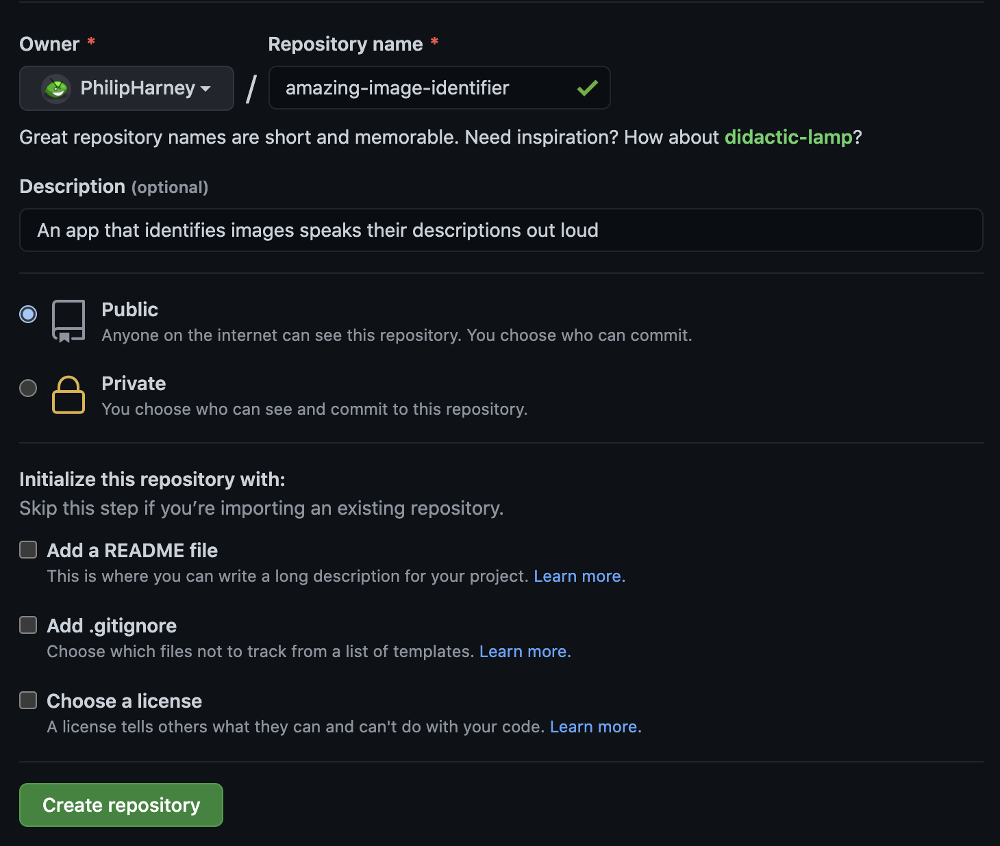
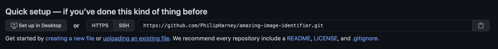
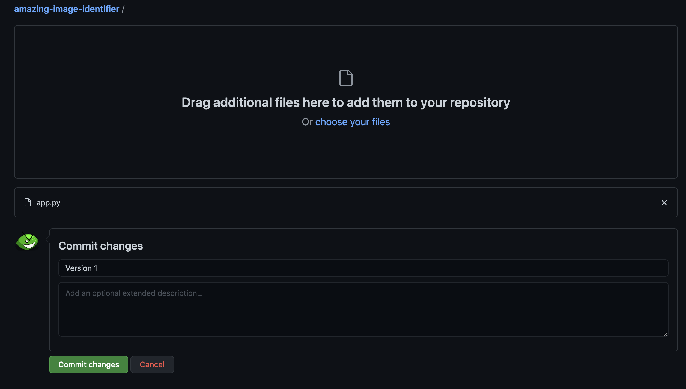
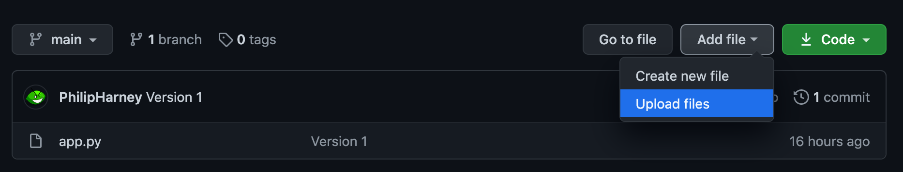

## Share

You can share your code with friends, family members, and people in a coding club, as well as people all over the world with the help of GitHub. GitHub is a website that has a tool called Git to help you store and share coding projects. With Git, these coding projects are called **repositories** (**repos** for short). Git and GitHub are used by millions of professional computer programmers every day. Every project on this website is stored on GitHub.

#### Be careful what you share

GitHub is on the web, so you should be careful about the kind of information you share like you would on any other website or app: 
+ Make sure you do not include photos of yourself or your friends
+ Don't include passwords or usernames
+ If you're ever unsure about sharing anything online, ask an adult you trust

#### Share your code on GitHub

To share your code on GitHub, you need to: 
+ Set up a GitHub account (or log in to your account) 
+ Create a new repository for this project 
+ **Commit** (upload) your code to the repository

--- collapse ---
---
title: Get a GitHub account
---
If you're over the age of thirteen, you can register for your own GitHub account. If you're under the age of thirteen, you need a parent or guardian to set up an account and allow you to use it.

To create an account, fill in the relevant details on the [GitHub site](https://github.com/join).
--- /collapse ---

--- collapse ---
---
title: Create a repository
---

Once you have an account, go to the [GitHub site](https://github.com/). Make sure you're signed in and click on the **New repository** button (it appears on the left-hand side).

In the screen that appears, you need to give your repository a name. You can also add a description. 

For now, leave the repository set to public. Don't worry about any of the three checkboxes, just click the **Create repository** button. 
--- /collapse ---

--- collapse ---
---
title: Make your first commit
---

Once the repository has been created, you should be shown a number of options on how to get started. In the 'Quick setup' section, choose the 'uploading an existing file' link.

Then you should be presented with a screen that gives you options to createa a commit. Drag any files that form part of your project into the repository and then give the commit a name. Remember to think carefully about what you put on the web. Since you can commit new versions of files later, the name of the commit helps you remember when you last changed a particular file. Since this is the very first commit of the project, you can pick a simple name like 'Version 1' or 'First commit'. You also have the option to add a more detailed description of the commit.

Then click the **Commit changes** button to save your commit!

--- /collapse ---

#### Make changes to your repository
Once you have made some changes to your project, you might want to update the version of it you're sharing in your repository. To change your repository, all you need to do is upload your files again, as part of a new commit.

--- collapse ---
---
title: Commit changes to your repository
---

On the GitHub page for your repository (which you can find on the left-hand side of [github.com](https://github.com) if you're signed in), you can use the 'Add file' menu to upload files.

You will then be presented with a screen that gives you options to createa a commit. Drag any files that form part of your project into the repository and then give the commit a name. Again, remember to be careful about what you put on the web. Don't worry about whether or not you've changed a file, GitHub can figure that out for you.

Then click the **Commit changes** button to save your commit and update your project.

--- /collapse ---

#### Share your repository

To share your repository, you can share its URL. It should look something like [https://github.com/raspberrypilearning/amazing-image-identifier](https://github.com/raspberrypilearning/amazing-image-identifier), but with your GitHub username and repository name instead of `raspberrypilearning` and `amazing-image-identifier`. Because you set the repository as 'public' when you created it, anyone can access it.
