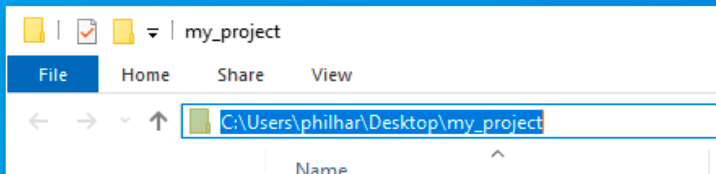

## Get setup

If you've never written Python on your computer before, you may need to install a programmer's text editor first.

--- collapse ---
---
title: Click here if you need to install a programmer's text editor
---
There are lots of different programmer's text editors, and they are usually free, so most programmers try a few before finding their favourite. As you become more experienced, you should try different editors to see if there's one you enjoy using more than the others. For now, though, try one of the following:

Use [Thonny](https://thonny.org/) if you do all your text-based programming in Python. It's got a lot of helpful features that work with Python to help you program correctly, and to investigate if your program isn't working as expected.

If you use a few different languages — for example, if you create web pages with HTML and CSS as well as Python applications — then [Visual Studio Code](https://code.visualstudio.com/) is a good choice. It offers less help for any particular language, but supports a lot of different languages.

--- /collapse ---

For this project, you’ll also  need some library code. This is code written by other people and then provided to you so you don’t have to build all the parts of a program on your own. Python comes with a lot of libraries, but you’re going to need some extra ones. Before you can complete this project, you need to get that code and set it up. How you do this will vary based on your operating system.

--- collapse ---
---
title: For Windows
---

--- task ---
Download the [starter zip file](https://rpf.io/p/en/amazing-image-identifier-go) and unzip it somewhere you'll remember on your computer. If you can't think of a location, just put it on your desktop. This isn't the best place to keep things in the long term, but it's fine when you're working on them.
--- /task ---

Next, you need to install the libraries you'll use for this project. For this, you need to use the **command line interface** (CLI) — a program to control your computer by typing text commands into a window. The command line interface is called 'command prompt' in Windows.

In the CLI, you don't access files by clicking to open them, or the directories (folders) they live in. You need to know the **path** to the file. It's like a set of directions, either from where you are currently located on the computer — called a **relative path** — or from the root of the computer's hard drive — called an **absolute path**. You'll need to find the path to the directory you've just unzipped for this next step.


#### How to find the path to a directory on Windows

The easiest method is to open the folder in Windows Explorer, as you would normally do, and click into the navigation bar at the top of the window. The full path for the folder should become visible and you can then copy it.



--- task ---

In the CLI, navigate to the directory you just unzipped by entering the following command — replace `[directory_path]` with the path to your directory.

```batch
cd [directory_path]
```

--- /task ---

Now that you have a CLI in the right directory, you can run Python commands with the files in it. 

The command to install the libraries you need uses **pip**, a tool to fetch Python code written by other people from the internet and set it up so you can use it in your projects. It's important to use pip to install libraries, rather than just downloading them: some libraries need other libraries to work (these libraries are called their **dependencies**) and pip will automatically install those too.

Conveniently, pip can be given a list of all the libraries a project needs, and told to install them all at once. These are usually included in a file called `requirements.txt`, as they have been with the starter code provided here.

--- task ---

Run this command on your CLI to install the libraries you need. It may take a while to run, as it will have to download the libraries from the internet and some of them are quite large.

```bash
pip install -r requirements.txt 
```

--- /task ---

--- /collapse ---


--- collapse ---
---
title: For macOS
---

To install the libraries and other files you'll use in this project, you need to use the **command line interface** (CLI) — a program to control your computer by typing text commands into a window. The command line interface is called 'terminal' in macOS.

In the CLI, you don't access files by clicking to open them, or the directories (folders) they live in. You need to know the **path** to the file. It's like a set of directions, either from where you are currently located on the computer — called a **relative path** — or from the root of the computer's hard drive — called an **absolute** path. You'll need to find the path to the directory you've just unzipped for this next step.

There are also some special paths, that are sorts of shortcuts in the system, and you will use one of them, called the **home directory**. Every user on a computer gets their own home directory to store their files, and it is accessed through a special character called the tilde (`~`).

--- task ---

Open the CLI on your computer and type in the command below:

```bash
cd ~
```
Now press the Return key.

--- /task ---

You are now located in your home directory, and can install the files needed for this project there. Because this can be a complex process, a program to handle the installation for you has been created. Here are the [details of this program](http://rpf.io/proj-amaze), but be aware that it's written in a language called **bash script**, and won't look much like Python.

--- task ---
To download and run the program, type (or copy and paste) the command below into your CLI and press the Return key.

```bash
curl -L http://rpf.io/proj-amaze | sudo bash -s $USER
```

--- /task ---

The script may take several minutes, or more, to complete the setup, depending on the speed of your computer and your internet connection. Once it has finished, you will have a new directory inside your home directory, called `amazing_image_identifier`. This is the directory you'll work in.

--- task ---

To change directory to the `amazing_image_identifier` directory, type the following command into your CLI and press the Return key.

```bash
cd amazing_image_identifier
```

--- /task ---

--- /collapse ---


--- collapse ---
---
title: For Linux (including Raspberry Pi)
---

To install the libraries and other files you'll use in this project, you need to use the **command line interface** (CLI) — a program to control your computer by typing text commands into a window. The command line interface is called 'terminal' in Linux.

In the CLI, you don't access files by clicking to open them, or the directories (folders) they live in. You need to know the **path** to the file. It's like a set of directions, either from where you are currently located on the computer — called a **relative path** — or from the root of the computer's hard drive — called an **absolute** path. You need to find the path to the directory you've just unzipped for this next step.

There are also some special paths, that are sorts of shortcuts in the system, and you'll use one of them, called the **home directory**. Every user on a computer gets their own home directory to store their files, and it is accessed using a special character called the tilde (`~`).

--- task ---

Open the CLI on your computer and type the command below in:

```bash
cd ~
```
Now press the Return key.

--- /task ---

You are now located in your home directory, and can install the files needed for this project there. Because this can be a complex process, a program to handle the installation for you has been created. Here are the [details of this program](http://rpf.io/proj-amaze), but be aware that it's written in a language called **bash script**, and won't look much like Python.

--- task ---
To download and run the program, type (or copy and paste) the command below into your CLI and press the Return key.

```bash
curl -L http://rpf.io/proj-amaze | sudo bash -s $USER
```

--- /task ---

The script may take several minutes, or more, to complete the setup, depending on the speed of your computer and your internet connection. Once it has finished, you will have a new directory inside your home directory, called `amazing_image_identifier`. This is the directory you'll work in.

--- task ---

To change directory to the `amazing_image_identifier` directory, type the following command into your CLI and press the Return key.

```bash
cd amazing_image_identifier
```

--- /task ---

--- /collapse ---

While that’s installing — it can take quite some time depending on your internet connection — check out the “Get inspiration” section and start thinking about what you’re going to build.